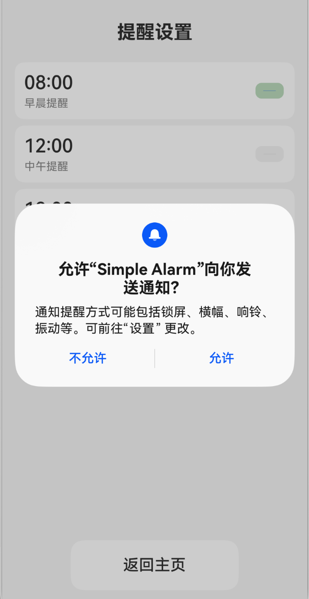
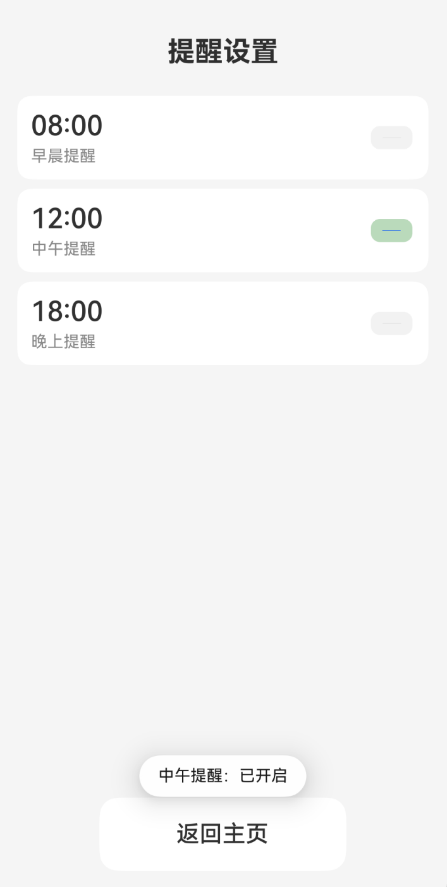
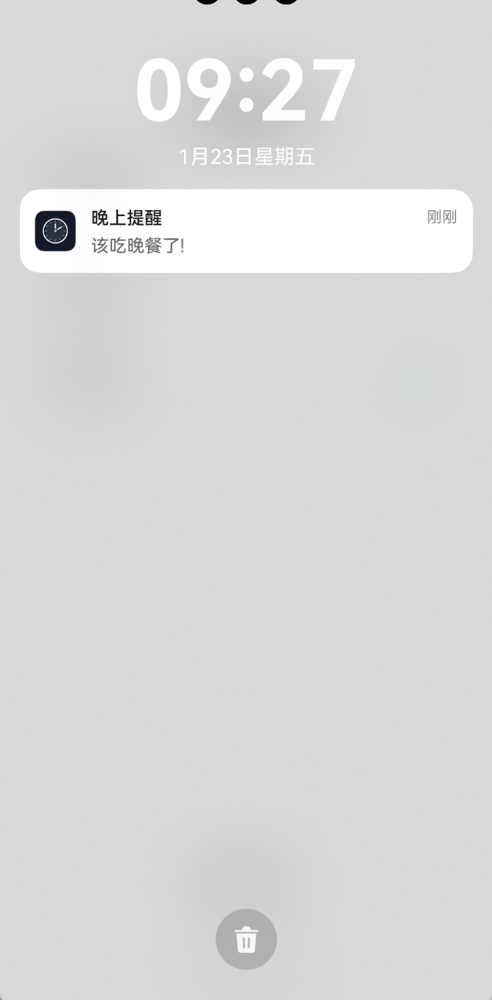
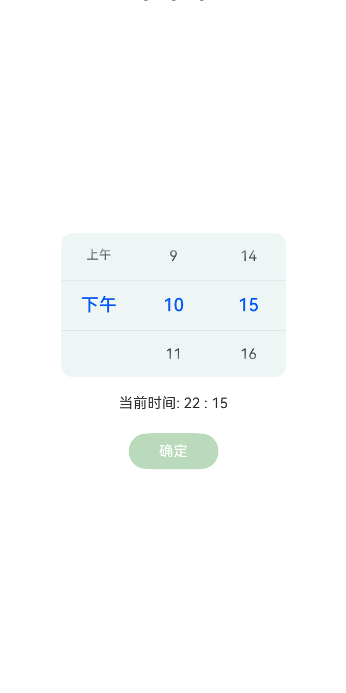

# 饭点提醒 Clock-Demo

这是一个基于 **HarmonyOS + ArkTS** 的练手项目，演示一个简易的饭点提醒应用，实现了翻页时钟展示与闹钟提醒功能。后续计划持续完善功能和体验。

## 🚀 项目简介

本项目旨在为大学生提供一个轻量化、贴心的饭点提醒工具。  
📌大学生因为课程、实验等原因常常错过饭点，而按时就餐对于健康很重要。

本应用展示当前时间（翻页交互风格），并允许用户设置早餐、午餐、晚餐三种提醒，当到达对应时间时会发送系统通知提醒。

## 📌 功能清单

### ✅ 首页

- 实时展示当前时间（翻页样式）
- 提供按钮跳转到提醒设置页面

### ✅ 提醒设置页

- 预置三个饭点提醒项：早餐 / 午餐 / 晚餐
- 点击时间区域可对提醒时间进行修改
- 右侧显示开关，可启用 / 关闭提醒
- 启用后，在设定时间触发系统通知提醒（已申请权限并发布通知）

## 📷 效果展示
<div align="center">
  
  
  
  
  
</div>
> 图片依次展示了`通知权限申请`、`首页时钟`、`提醒设置页`、`触发提醒`、`时间修改页`的实际运行结果。

## 🛠 运行与开发

1. 克隆仓库到本地

   ```bash
   git clone https://github.com/DEMON-coding/HarmonyOs-Clock-Demo.git
   ```

2. 在 **DevEco Studio** 中打开项目

   * 使用 HarmonyOS SDK（建议 API Level 对应最新版本）
   * 等待项目索引 / 依赖构建完成

3. 连接设备或打开模拟器

   * 运行应用即可体验

## 📦 技术栈

| 技术            | 说明                |
| ------------- | ----------------- |
| HarmonyOS     | 应用运行平台            |
| ArkTS         | ArkUI 声明式 UI 开发语言 |
| DevEco Studio | 官方 IDE，用于开发与调试    |
| 系统通知          | 用于闹钟提醒通知授权与发布     |

## 💡 设计思路

* **首页时钟展示**：通过状态变量与定时器实时更新 UI，提高可视交互感
* **提醒逻辑**：使用通知权限申请 + 本地通知，确保提醒到达即弹出系统提醒
* 提醒设置页采用卡片布局，结合开关控制，提升交互体验

## 📅 未来规划

以下为未来计划开发内容：

* 💤 **贪睡/延迟提醒功能**
* ➕ **自定义提醒项**，不再固定三餐
* 🕒 **重复周期设置**（如每天/工作日/周末）
* 📌 **持久化存储提醒数据**（DataStore / Preferences）
* 🎨 美化 UI 样式 / 支持深色模式
* 📱 多终端适配（平板、大屏等）

## 📜 授权许可

本项目采用 **Apache-2.0 License** 开源协议。

欢迎 Star ⭐ 和 Fork 🧑‍💻！
